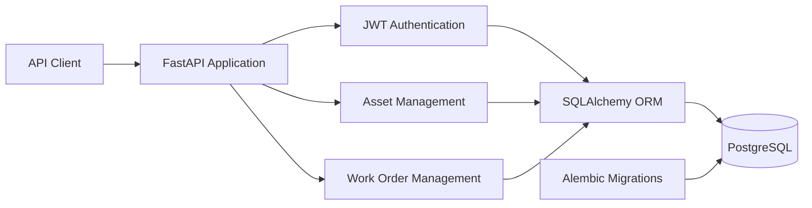
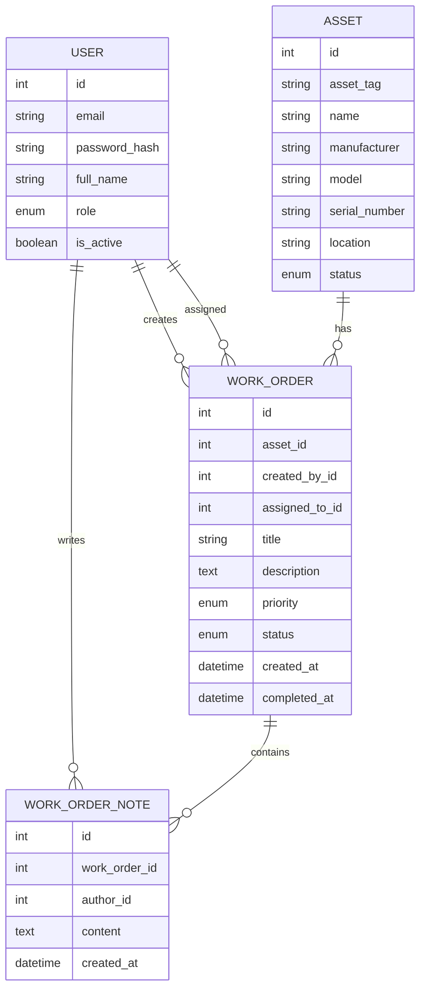

# Work Order Management API

FastAPI backend for managing equipment assets, maintenance work orders, technician assignments, service notes, and maintenance history.

The project demonstrates production-oriented backend concepts including PostgreSQL relational modeling, SQLAlchemy ORM, Alembic migrations, JWT authentication, business-rule enforcement, automated API testing, Docker, and continuous integration.

[](https://github.com/WilliamW-D/work-order-api/actions/workflows/tests.yml)


## Features

- Secure user registration and JWT authentication
- Argon2 password hashing
- Equipment asset management
- Asset retirement with historical preservation
- Maintenance work-order creation and assignment
- Work-order priority and status workflows
- Technician validation
- Service notes with authenticated authorship
- Asset maintenance-history retrieval
- Filtering and pagination
- PostgreSQL persistence
- SQLAlchemy ORM relationships
- Alembic database migrations
- Automated pytest integration tests
- PostgreSQL-backed GitHub Actions CI
- Dockerized local environment

## Quick Start with Docker

Clone the repository:

```bash
git clone https://github.com/WilliamW-D/work-order-api.git
cd work-order-api
```

Start the API and PostgreSQL:

```bash
docker compose up --build
```

Open the interactive API documentation:

http://localhost:8000/docs

Stop the application:

```bash
docker compose down
```

## Business Rules

The API includes application-level rules beyond basic CRUD.

Examples:

- Work orders cannot be created for retired assets.
- Work orders may only be assigned to active technicians.
- Completed and cancelled work orders cannot be modified normally.
- Work-order completion records a completion timestamp.
- Invalid work-order status transitions are rejected.
- Asset deletion retires the asset instead of removing historical data.
- Work-order notes retain the identity of the authenticated author.
- Retired assets retain their complete maintenance history.

## API Overview

| Method | Endpoint | Purpose |
|---|---|---|
| POST | `/auth/register` | Register a user |
| POST | `/auth/token` | Authenticate and receive JWT |
| GET | `/users/me` | Get authenticated user |
| POST | `/assets` | Create an asset |
| GET | `/assets` | Search and list assets |
| PATCH | `/assets/{id}` | Update an asset |
| DELETE | `/assets/{id}` | Retire an asset |
| GET | `/assets/{id}/history` | View maintenance history |
| POST | `/work-orders` | Create a work order |
| GET | `/work-orders` | Filter and list work orders |
| PATCH | `/work-orders/{id}` | Update a work order |
| POST | `/work-orders/{id}/assign` | Assign technician |
| POST | `/work-orders/{id}/complete` | Complete work |
| POST | `/work-orders/{id}/notes` | Add service note |

## Testing

The integration test suite exercises the API against PostgreSQL rather than replacing the database layer with mocks.

Coverage includes:

- registration and authentication
- JWT-protected endpoints
- duplicate validation
- asset creation and retirement
- filtering and pagination
- work-order creation
- status transitions
- retired-asset restrictions
- work-order completion
- service notes
- maintenance history

Run locally:

```bash
pytest -v
```

GitHub Actions automatically starts PostgreSQL, applies Alembic migrations, and runs the test suite for pushes and pull requests.

## Design Decisions

### PostgreSQL instead of SQLite

This application contains multiple related entities, concurrent API operations, foreign keys, and migration-managed schema changes. PostgreSQL better represents the database environment expected for a multi-user backend application.

### Alembic instead of create_all()

Database changes are version controlled through migrations rather than being generated automatically at application startup.

### Asset retirement instead of deletion

Maintenance records remain useful after equipment leaves service. Retiring assets preserves work-order history while preventing new work from being created.

### Explicit completion endpoint

Completing a work order affects multiple pieces of application state, including status and completion timestamp, so it is modeled as a business operation rather than a generic field update.

### Integration tests with PostgreSQL

The test suite exercises the actual persistence layer and migrations instead of assuming behavior from an in-memory substitute.

## Architecture



## Database Model

